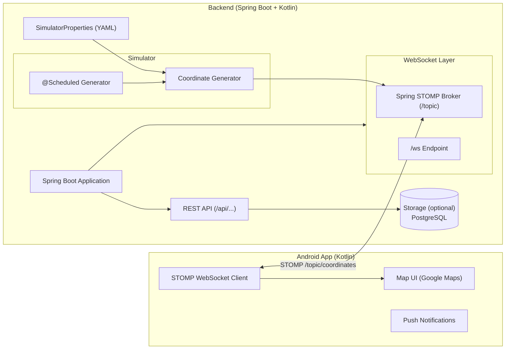
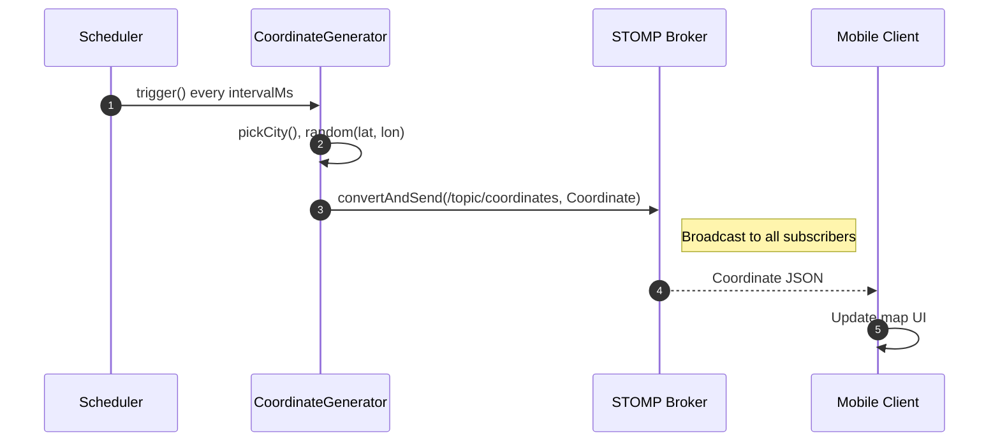
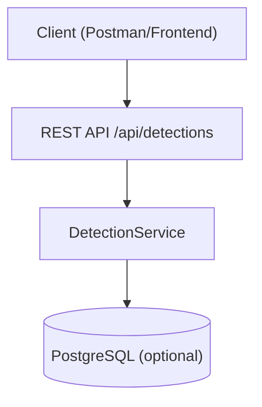

# 🗺️ System Architecture Diagrams

This document contains **Mermaid** diagrams describing the backend architecture and the real-time WebSocket flow.

---

## 1) Component Overview

---

## 2) WebSocket Publish Flow (Sequence)

---

## 3) REST Interactions (High-level)

---

### Notes
- The **Scheduler** uses `@Scheduled` with `fixedRateString = "\${drone.simulator.interval-ms}"`.
- The **SimulatorProperties** binds to `application.yml` for multiple cities support.
- The **STOMP Broker** broadcasts on `/topic/coordinates`; clients connect via `/ws`.
